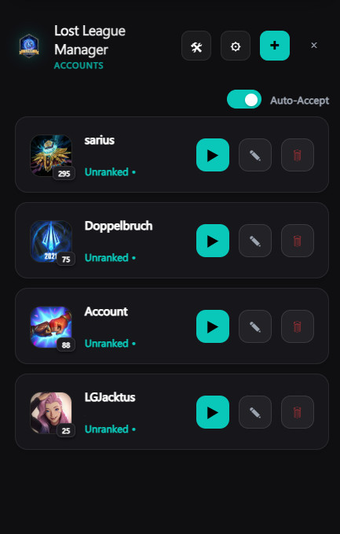

# Lost League Manager

<div align="center">
  
  <br><br>

**Lost League Manager** is a lightweight utility designed to enhance your League of Legends experience.

## Key Features

- **Instant Auto-Login**: Securely store multiple accounts and log in with a single click. The app handles process termination and credential entry automatically.
- **Secure Input**: Features reliable input handling (mouse/keyboard locking) during login to ensure credentials are typed correctly every time.
- **Auto Queue & Accept**: Automatically start queuing for your preferred game mode and accept matches instantly.


To build the application locally:

1.  **Clone the repository**
    ```bash
    git clone https://github.com/mauricekliendienst/lost-league-manager.git
    cd leaguelogin
    ```
2.  **Install Dependencies**
    ```bash
    npm install
    ```
3.  **Run (Dev Mode)**
    ```bash
    npm start
    ```
4.  **Build Installer**
    ```bash
    npm run build
    ```

This software is an unofficial fan-made utility and is not endorsed by or affiliated with Riot Games. Use at your own risk.

